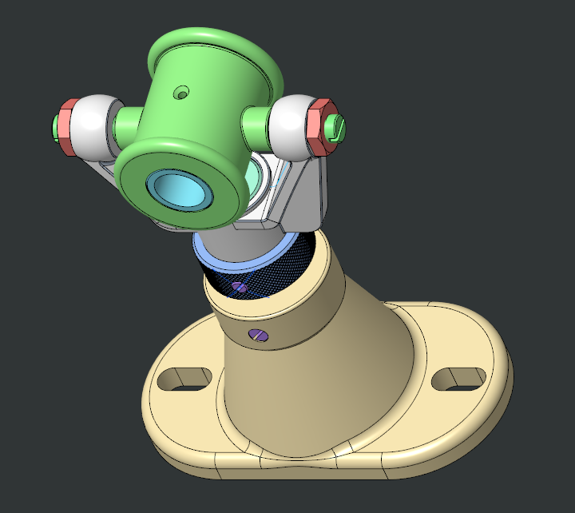
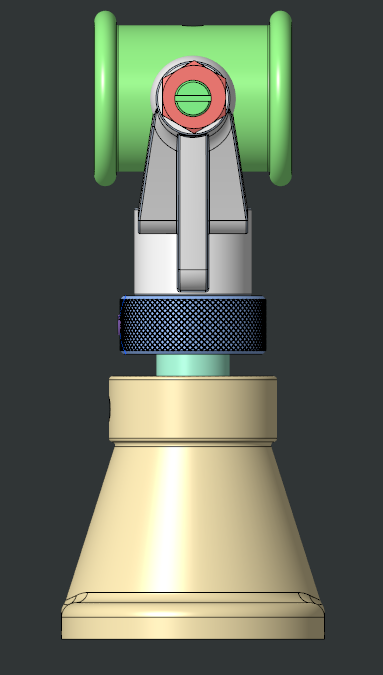
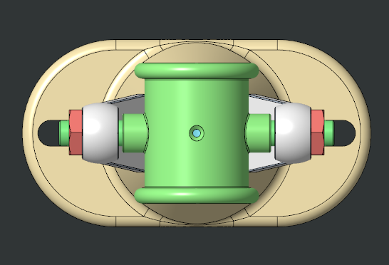

# Swivel Bearing Assembly

A CAD model and assembly of a swivel bearing mechanism made using PTC Creo.

The project includes the individual parts, complete assembly, STEP files, and different views of the assembled mechanism.

## About the Project

This project was created to understand and work with a multi-part mechanical assembly in Creo.

It includes the modeling and assembly of components such as the base, fork, spindle, bearing block, bush, discs, nuts and set screws.

The assembly was also exported in STEP format so that the models can be viewed and used across different CAD software.

## Software Used

- PTC Creo

## Assembly Views

### Isometric View

### Exploded View

### Section View

## Orthographic Views

### Front View

### Side View

### Top View

## Files

The repository contains:

- Complete assembly in STEP format
- Individual component STEP files
- Assembly and exploded views
- Section view
- Assembly demonstration video

## What I Worked On

- 3D part modeling in Creo
- Assembly and component placement
- Assembly constraints
- Exploded and section views
- Exporting CAD models to STEP format
- Organizing CAD files

## Assembly Demo

[▶️ Watch the Assembly Demo](Media/Assembly_Demo.mp4)
